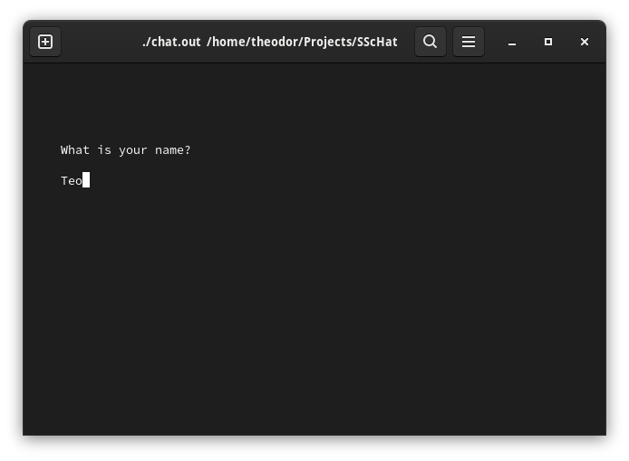
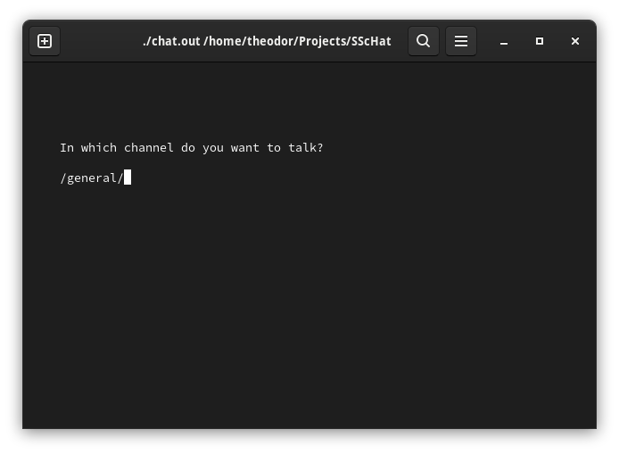
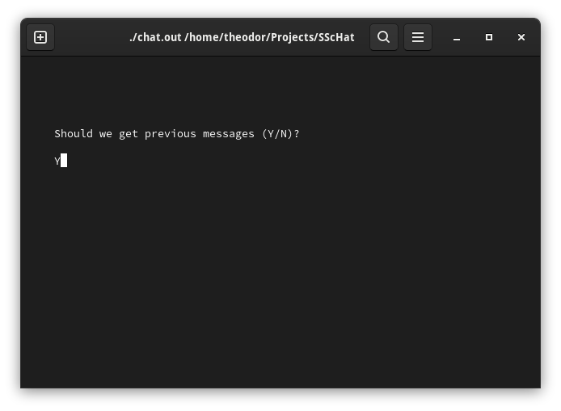
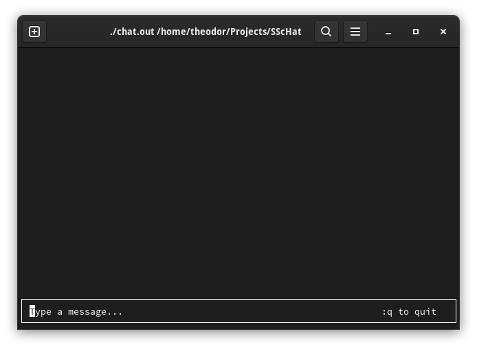
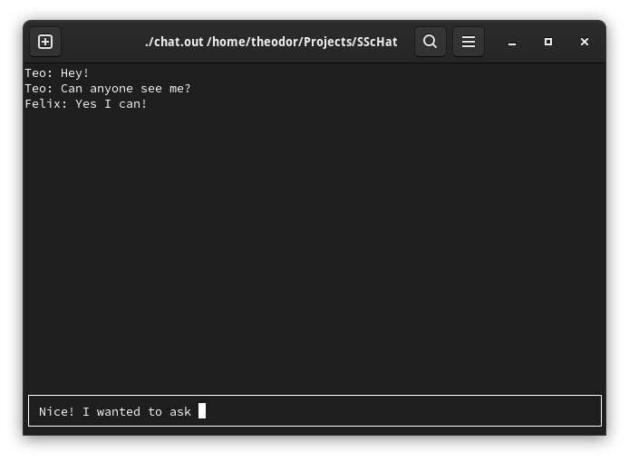

# SScHat -- Chatting app for SSH clients

This app uses the Telemetry client (imported as a submodule).
It's main utility is to be able to chat with multiple users all connected to the same SSH machine on the same user.

## Indented Usage

### Wecome Screen - Name Prompt

### Wecome Screen - Channel Prompt

### Wecome Screen - Message Recovery Prompt

### Chat Screen - No Written Message

### Chat Screen - Written Message

## How To Use

 * First Clone the repo.
 * Make sure to initialize the `Telemetry` submodule.
 * Compile the code with `$ make`.
 * Run SSChat with `$ ./chat.out`.